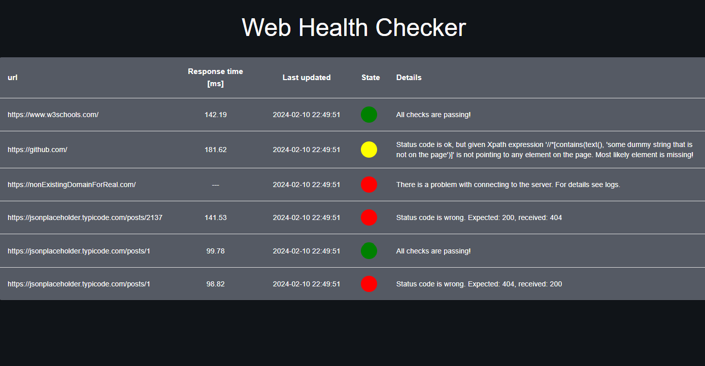

# Web Health Checker

App that monitors web sites and reports their availability. This tool is intended as a monitoring tool for web site administrators for detecting problems on their sites.


<p align="center">
  
</p>

#### Prod prerequisites
- docker (v. 20.10.23)

#### Running the app

1. Create a config file (based on example)
```sh
cd backend
cp -n config_example.yaml config.yaml
```

2. Run app with
```sh
docker compose up
```

3. Visit http://localhost:3000

#### Dev prerequisites
*Note: versions in Dockerfiles are more up to date and app should still work so you can check there*
- docker (v. 20.10.23)
- python (v. 3.10.6)
- npm (v. 9.5.1)
- node (v. 18.16.1)

#### Development

[Create config file](#running-the-app)

Run redis
```sh
docker run --rm --name some-redis -p 6379:6379 redis:latest
```

Run backend
```sh
cd backend
python3 -m venv ./venv
. ./venv/bin/activate
pip install -r requirements/dev.txt
uvicorn src.main:app --reload --port=8000
```

Run celery
```sh
cd backend
celery --app=src.main.celery_app worker --concurrency=1 --loglevel=DEBUG
```


Run frontend
```sh
cd frontend
npm install --force
npm start
```


TODO:
- [ ] Logs (use python logging with custom setup)
- [ ] Code cleanup
- [ ] config file description
