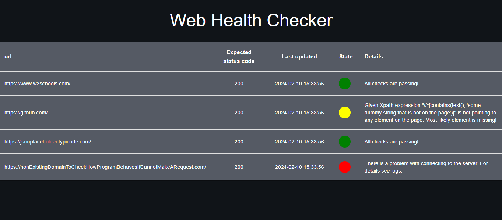

# web-health-checker


<p align="center">
  
</p>

Create a config file (based on example)
```sh
cd backend
cp -n config_example.yaml config.yaml
```


TODO:
- [ ] Logs (use python logging with custom setup)
- [ ] Measure time (request processing)
- [ ] Code refactor (back/front), validation, typing etc
- [ ] docs (readme)
- [ ] deploy (root level docker compose)
